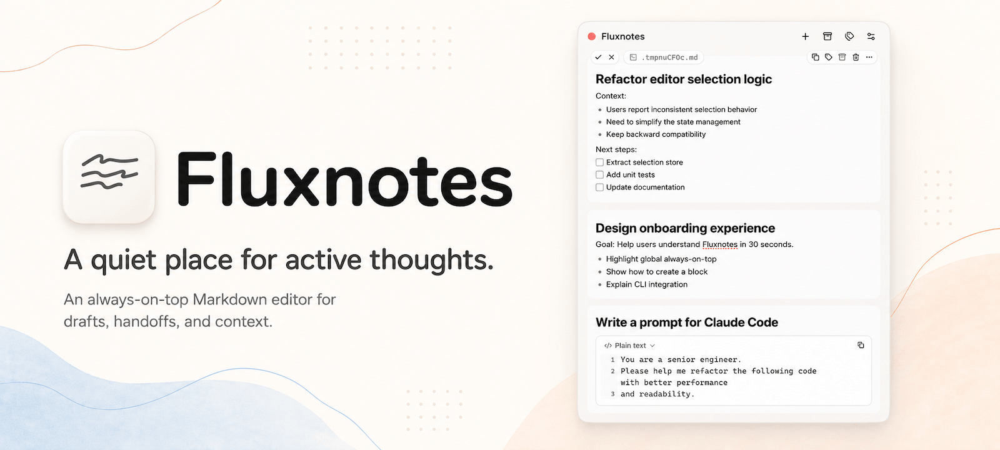

# Fluxnotes



<p align="center">
  
  <a href="https://github.com/chansyawn/fluxnotes/releases"></a>
  <a href="https://github.com/chansyawn/fluxnotes/releases"></a>
</p>

<p align="center">
  English | <a href="./README.zh.md">中文</a>
</p>

Fluxnotes is a lightweight[^lightweight], always-on-top Markdown Block editor for AI-era workflows.

It is not another knowledge base, and it is not a full Markdown editor. It is a visible context buffer: each Block is an input draft that can be edited, organized, and archived independently.

- **Polish input**: organize and revise longer text before sending it to chat tools, CLI agents, or other input boxes.
- **Organize context**: keep temporary working context while switching between tasks, windows, and tools.
- **Capture temporary notes**: save ideas, snippets, and pending items before moving them into a more formal knowledge base or document.

## Getting Started

Download the latest version from [GitHub Releases](https://github.com/chansyawn/fluxnotes/releases).

> Fluxnotes is still in early development. Some parts may be unstable or incomplete. Issues and suggestions are welcome on [GitHub Issues](https://github.com/chansyawn/fluxnotes/issues)[^feedback].

## Features

- **Always on top**: stays visible while you move between browsers, IDEs, terminals, documents, and AI tools, acting as a temporary context buffer for the current work.
- **Auto archive**: automatically moves inactive Blocks out of the active Workspace to reduce buildup from long-running parallel tasks.
- **WYSIWYG Markdown**: write Markdown in a close-to-what-you-see-is-what-you-get editing experience for structured prompts and notes.
- **Input handoff**: use the `flux` CLI to open Fluxnotes, create Blocks, or connect it as an external editor for CLI agents such as Codex and Claude Code. More launch and handoff paths will be explored over time.

## Usage

### Install Flux CLI

Open Fluxnotes Preferences, go to the App section, find Flux CLI, and click Install. After installation, run:

```bash
flux --help
```

to view available commands and options.

### Use With Codex / Claude Code

Use aliases to enable Fluxnotes only for Codex / Claude Code:

```bash
alias cdx='EDITOR="flux edit" codex'
alias cld='EDITOR="flux edit" claude'
```

Then start the tools with `cdx` or `cld`. When they enter an external edit flow, the content opens in Fluxnotes. You can polish the input there, then submit or cancel the edit.

Avoid setting `EDITOR="flux edit"` as your global default editor. A global `EDITOR` affects Git, shell commands, and other CLI tools.

### Create Content From the Terminal

```bash
flux
flux add "Summarize the current task context and next step"
flux add --file prompt.md --tag codex
```

- `flux`: open Fluxnotes.
- `flux add "..."`: create a Block from inline text.
- `flux add --file prompt.md --tag codex`: create a Block from a UTF-8 text file and add a Tag.

## Why Fluxnotes

Most AI products are conversational: web chat, desktop chat, CLI agents. Their input boxes are usually great for sending a quick message, but not for carefully shaping structured input.

At the same time, AI increases how much work can happen in parallel. Multiple tools, projects, and tasks interrupt each other often, and people need one place to organize their own context.

Fluxnotes focuses on that middle layer: before sending something to an AI tool, you get a lightweight, visible Workspace for drafting and iteration.

## Roadmap

- Broader Markdown syntax support and a better editing experience.
- Smoother input handoff: explore Accessibility APIs, browser extensions, and other ways to launch Fluxnotes from input boxes or send content directly to different AI apps.

## Another Option

If Fluxnotes is not mature or stable enough for you yet, try [Raycast Notes](https://www.raycast.com/core-features/notes). It inspired Fluxnotes and is more mature, simpler, and more restrained.

[^lightweight]: "Lightweight" here refers to the product shape and workflow. Fluxnotes is built with Electron, so the underlying stack itself is not lightweight.

[^feedback]: Sorry, external PRs are not accepted at this stage. The product direction and internal architecture are still changing quickly, and accepting external contributions too early would add maintenance overhead.
