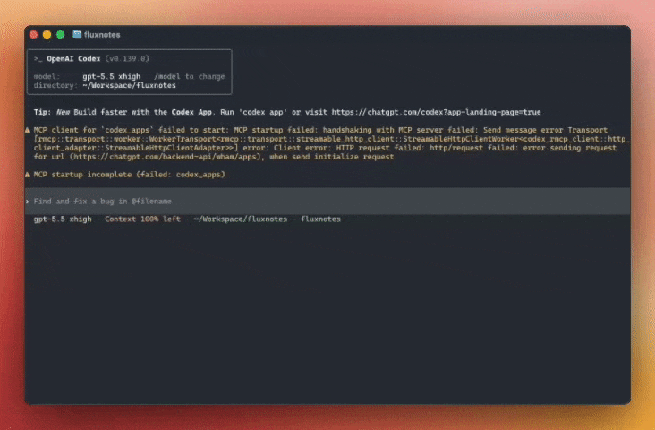

# Fluxnotes


<p align="center">
  
  <a href="https://github.com/chansyawn/fluxnotes/releases"></a>
  <a href="https://github.com/chansyawn/fluxnotes/releases"></a>
  <a href="https://linux.do"></a>
</p>

<p align="center">
  <a href="../../README.md">English</a> | 简体中文
</p>

Fluxnotes 是一个适合 AI 时代工作流的轻量[^lightweight]全局置顶 Markdown Block 编辑器。

它不是另一个知识库，也不是完整的 Markdown 编辑器，而是一个随时可见的上下文暂存区：每个 Block 都是一段可独立编辑、整理和归档的输入草稿。

- **完善输入**：先组织和修改较长内容，再交给 Chat、CLI Agent 或其他输入框。
- **整理上下文**：在多任务、多窗口切换时，保存临时工作内容。
- **临时记录**：记录灵感、片段和待处理内容，之后再沉淀到更正式的知识库或文档。

## 安装

前往 [GitHub Releases](https://github.com/chansyawn/fluxnotes/releases) 下载最新版。Fluxnotes 当前支持 macOS 和 Windows。

> Fluxnotes 仍处于早期开发阶段，可能存在不稳定或体验不完整的地方。欢迎通过 [Issues](https://github.com/chansyawn/fluxnotes/issues) 反馈问题和建议[^feedback]。

## 特点

- **全局置顶**：作为一个始终可见的置顶编辑窗口存在，在浏览器、IDE、终端、文档和多个 AI 工具之间切换时，它可以作为当前工作的上下文暂存区。
- **自动归档**：自动把不再活跃的 Block 移出当前工作区，减少长期并行任务带来的堆积。
- **WYSIWYG Markdown**：用接近所见即所得的方式写 Markdown，适合编写结构化 prompt。
- **输入流转**：在 macOS 上从当前 Mac App 输入框启动 External edit，或通过 `flux` CLI 打开应用、创建 Block、接入 Codex / Claude Code 等 CLI Agent。

## 用法

### 日常使用

强烈建议使用快捷键控制窗口、Block 操作和编辑动作。Fluxnotes 是一个全局置顶的临时工作区，快捷键可以减少在鼠标、输入框和不同应用之间来回切换。

- `Alt/Option+N`：显示或隐藏 Fluxnotes 窗口。
- 更多窗口、Block 和编辑快捷键可以在 Fluxnotes 的「偏好设置」中查看和修改。

### 输入流转示例

| Mac App 输入框                                                                                          | Web 输入框                                                                                          | CLI Agent                                                                                             |
| ------------------------------------------------------------------------------------------------------- | --------------------------------------------------------------------------------------------------- | ----------------------------------------------------------------------------------------------------- |
|  |  |  |

### 从 Mac App 输入框编辑

External edit 目前仅支持 macOS。首次使用前，在「偏好设置」的「External edit」分区授予「辅助功能」权限。

将光标放在目标 App 的输入框中，按 `Command+Option+N`，Fluxnotes 会把当前输入内容打开成一个 Block。编辑完成后点击提交，或按 `Command+Enter` 写回；取消可按 `Command+\`。如果目标输入框不支持直接写回，Fluxnotes 会改为复制到剪贴板。密码框等安全输入框不支持读取或写回，相关快捷键可在「Shortcuts」中修改。

### 使用 Flux CLI

打开 Fluxnotes 的「偏好设置」，在「App」分区找到「Flux CLI」并点击安装。安装后可以在终端运行 `flux --help` 查看当前可用命令与参数。

#### 配合 Codex / Claude Code 使用

用 alias 只为 Codex / Claude Code 启用 Fluxnotes：

```bash
alias cdx='EDITOR="flux edit" codex'
alias cld='EDITOR="flux edit" claude'
```

之后用 `cdx` 或 `cld` 启动 CLI Agent。在 Codex / Claude Code 中按默认外部编辑器快捷键 `Ctrl+G`；alias 会通过 `EDITOR="flux edit"` 把草稿送入 Fluxnotes。

在 Fluxnotes 里修改完善后，提交或取消即可回到 CLI Agent。

不建议全局设置 `EDITOR="flux edit"`；它也会影响 Git、shell 和其他 CLI 工具。

#### 从终端创建内容

```bash
flux
flux add "整理这次任务的上下文和下一步"
flux add --text "整理这次任务的上下文和下一步"
flux add --file prompt.md --tag codex
flux edit prompt.md
```

- `flux`：打开 Fluxnotes。
- `flux add "..."`：从行内文本创建一个 Block。
- `flux add --text "..."`：显式从行内文本创建一个 Block。
- `flux add --file prompt.md --tag codex`：从 UTF-8 文本文件创建 Block，并添加 Tag。
- `flux edit prompt.md`：把文件作为外部编辑草稿交给 Fluxnotes，提交或取消后回到调用方。

## 为什么创建 Fluxnotes

大多数 AI 应用都通过对话交互：网页 Chat、桌面 Chat、CLI Agent。它们的输入框通常很适合“快速发一句”，却不适合认真组织一段结构化输入。

与此同时，AI 极大提高了工作的并行度。多个工具、多个工程、多个任务会频繁插入和打断，人类也需要一个集中的地方整理自己的「上下文」。

Fluxnotes 试图解决的就是这个中间层问题：在正式提交给 AI 之前，先有一个轻量、始终可见、适合反复修改的输入工作区。

## 隐私与本地数据

Fluxnotes 会将用户数据存储在 `~/.flux`。如需彻底卸载 Fluxnotes，或在应用无法启动时重置本地状态，可以删除该文件夹。这会清除本地 Blocks、设置，以及应用管理的 Flux CLI 文件。

Fluxnotes 包含可关闭的遥测设置，用于帮助理解功能使用情况和诊断问题。你可以在「偏好设置」中关闭遥测。

## 后续规划

- 更完整的 Markdown 语法支持和更好的输入体验。
- 更便捷的输入流转：继续探索从更多输入场景唤起 Fluxnotes，或将内容直接传递给不同 AI 应用。

## 替代选择

如果你觉得 Fluxnotes 现阶段还不够成熟稳定，可以先试试 [Raycast Notes](https://www.raycast.com/core-features/notes)。它是 Fluxnotes 的灵感来源，更加成熟，也更加简洁克制。

[^lightweight]: 这里的“轻量”指产品形态和使用方式轻量。Fluxnotes 基于 Electron 构建，技术栈本身并不轻量。

[^feedback]: 很抱歉，当前阶段暂不接受 PR。项目仍在快速探索产品方向和内部架构，过早引入外部贡献可能会增加维护成本。
